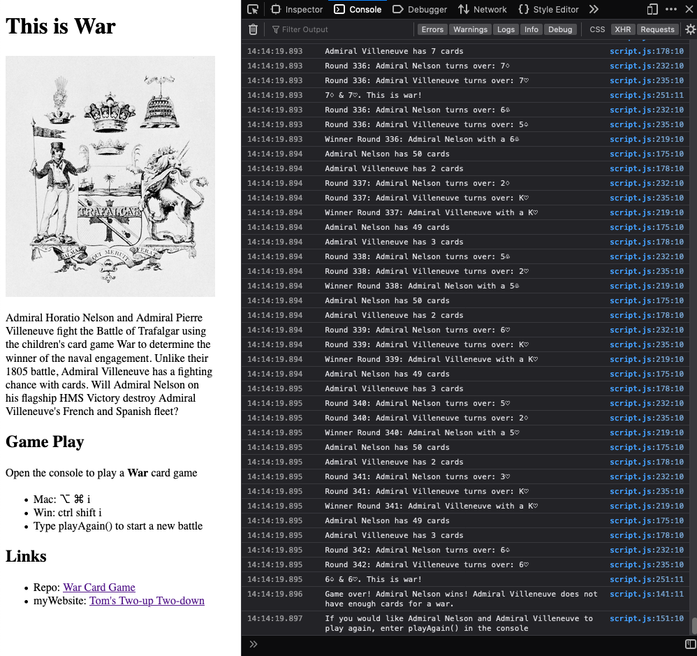

# War Card Game

Website: [War Card Game](https://thwcorbin.github.io/war-game/ "Tom's War card game")

Play a game of [War](https://www.pagat.com/war/war.html "Pagat entry for War card game") in a web browser console.

## Description

Admiral Horatio Nelson and Admiral Pierre Villeneuve fight the [Battle of Trafalgar](https://www.britannica.com/event/Battle-of-Trafalgar-European-history "Encyclopedia Britannica entry for the Battle of Trafalgar") using the children's card game [War](https://www.pagat.com/war/war.html "Pagat entry for War card game") to determine the winner of the naval engagement. Unlike their 1805 battle, Admiral Villeneuve has a fighting chance with cards. Will Admiral Nelson on his flagship [HMS Victory](https://www.britannica.com/topic/Victory-British-ship "Encyclopedia Britannica entry for the HMS Victory") destroy Admiral Villeneuve's French and Spanish fleet? Learn how to play the game below.

The War Card Game is my second project for [General Assembly's](https://generalassemb.ly/ "General Assembly homepage") Software Engineering Immersive program.

## Game Play

Shuffle a deck of cards and deal each player 26 cards. Each player turns over the top card in their hand at the same time. The player with the highest ranking card takes both cards and adds them to the bottom of their hand. Aces are high, and card suits do not matter.

If the players' cards tie, the players have a War. Each player places three cards face down and turns over their fourth card face up. The player turning over the highest card takes all of the cards in the middle. If there is a tie during the war, the players repeat the war process until there is a winner.

The players continue turning over their top cards until the game ends one of two ways. One player has all 52 cards, or one player does not have enough cards in the event of a war. (A player needs four cards in hand for a war: three cards to place face down and one card to turn face up.) The winner exults in righteous glory.(1)

## Technologies

- JavaScript
- HTML

## Installation

- Clone the repo: https://github.com/ThwCorbin/war-game

## Usage

- cd to the war-game directory
- Open index.html in your browser(2)
- Open your browser console to play the game
- To play again, enter `playAgain()` in the console

- or click here: [War Card Game](https://thwcorbin.github.io/war-game/ "Tom's War card game")

## License

[MIT](LICENSE.txt "MIT License text file")

## Notes

Note 1: The game play description is based on the General Assembly course requirements documentation and the [Pagat website entry for War](https://www.pagat.com/war/war.html "Pagat entry for War card game").

Note 2: I use [Live Server](https://marketplace.visualstudio.com/items?itemName=ritwickdey.LiveServer "Live Server extension") to serve my program from my code editor, [VS Code](https://code.visualstudio.com/ "Visual Studio Code editor").
